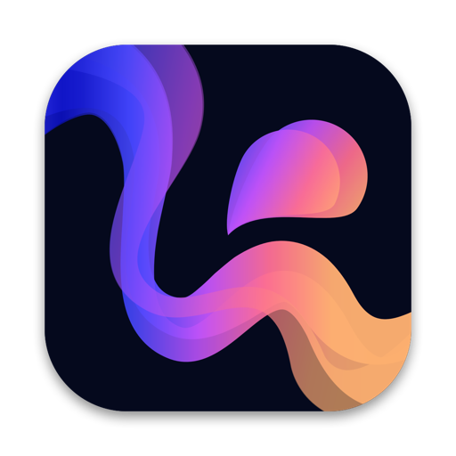

<div align="center">



# Inktion

**Draw it. Rig it. Make it move.**<br>
A 2D animation studio for frame-by-frame drawing, vector art, rigging and motion, for macOS and Windows.

[](https://github.com/HotcakeHooligan/inktion-releases/releases)


### [⬇&nbsp; Download Inktion](https://github.com/HotcakeHooligan/inktion-releases/releases/latest)

<sub>No account · No tracking · Updates itself</sub>

</div>

> [!WARNING]
> **Inktion is in beta.** It's still young and you may run into bugs. Save often and keep
> backups of work you care about. Please [report problems](https://github.com/HotcakeHooligan/inktion-releases/issues)
> so they can be fixed.
>
> The app isn't code-signed yet, so your computer will warn you the first time you open it.
> [Here's why, and how to open it safely.](#why-your-computer-warns-about-inktion)

---

## What you can do with Inktion

<table>
<tr>
<td width="50%" valign="top">

### ✏️ Draw

- **Vector and raster layers** side by side: clean, editable lines or painterly pixels
- **Custom brushes**: ink pen, pencil, charcoal, chalk, airbrush, marker, calligraphy and
  your own, with paper grain, jitter and tapering
- **Made for the mouse**: simulated pressure and a rope stabilizer give smooth, confident lines
- **Shapes, pen, node and width tools**, gradients, and fills that close small gaps
- **Perspective grids, straight edges and guides** your lines snap to

</td>
<td width="50%" valign="top">

### 🎞️ Animate

- **Frame-by-frame** with onion skin, a light table and drawing swapping
- **Motion and shape tweens** with easing curves and motion paths
- **Graph editor** for fine-tuning every animated property
- **Timeline power tools**: animate on 2s and 3s, loops, copying keys, exposure dragging,
  color labels, solo
- **Own timing per layer**: loop, ping-pong or hold placed animations

</td>
</tr>
<tr>
<td width="50%" valign="top">

### 🦴 Rig

- **Bones** with forward and inverse kinematics, angle limits and bendy limbs
- **Automatic follow-through**: hair, tails and cloth swing with floppiness and bounce
- **Mesh warp** that tweens between shapes
- **Pin art to bones**, masks and clipping layers
- **Reusable assets**: drag rigs, images and animations into any scene

</td>
<td width="50%" valign="top">

### 🎥 Direct

- **Scene camera** with pan, zoom, rotation and dolly moves
- **Multiplane depth** with automatic parallax
- **Scenes** that play back to back, and scene clips that nest one scene in another
- **Layer effects**: drop shadow, glow, bevel, line boil and 13 blend modes
- **Adjustment layers**: blur, hue and saturation, color tint and more

</td>
</tr>
<tr>
<td width="50%" valign="top">

### 🔊 Sound

- **Import audio** (WAV, MP3, M4A, FLAC, OGG and more) and scrub it in sync
- **Waveforms on the timeline** for timing to the beat
- **Auto lip-sync** picks mouth drawings from the dialogue

</td>
<td width="50%" valign="top">

### 📤 Export

- **Video**: MP4, ProRes MOV and WebM, with your soundtrack
  (MOV and WebM keep transparency)
- **GIF, PNG sequence, PNG image and sprite sheets** for games and the web
- **SVG and Lottie** for scalable, web-ready vector animation
- **Import video** as a reference layer for rotoscoping

</td>
</tr>
</table>

### And the details

- 🌗 **Adjustable interface brightness**, from deep dark to light, with text that stays readable
- ⌨️ **Your shortcuts**: presets for Animate, Toon Boom Harmony, Moho and Photoshop, or record your own
- 🧩 **Templates** for video, social, games and animation, plus your own
- 💾 **Autosave and crash recovery**, and compact project files
- 🔄 **Automatic updates**: new versions install from inside the app

---

## Why your computer warns about Inktion

When you open Inktion for the first time, macOS or Windows will probably warn you that the app
is from an "unidentified developer", "unrecognized", or even that it might be harmful.
**This is expected, and it doesn't mean anything is wrong with the app.**

Apple and Microsoft only fully trust apps that are **code-signed**. That means the developer
has bought a yearly certificate and registered with them. Inktion is an independent project
and isn't signed yet. Without a signature, the operating system can't tell who made the app,
so it shows the same warning it would show for any unsigned download. Windows' SmartScreen and
some antivirus tools can also flag new, unsigned apps simply because few people have
downloaded them yet. These are **false positives**.

What Inktion does and doesn't do:

- It **doesn't collect data**. There are no analytics, no tracking and no account.
- Its **only network access** is checking this page for new versions. You can turn that off in
  Settings › General › Updates.
- Your projects stay on your computer, as ordinary `.inkt` files.

### Check your download (optional)

Each release includes a `SHA256SUMS.txt` file. If the fingerprint of your download matches the
one listed there, you have the exact file that was published:

- **macOS** (Terminal): `shasum -a 256 ~/Downloads/Inktion-*-macos-arm64.zip`
- **Windows** (PowerShell): `Get-FileHash $HOME\Downloads\Inktion-*-windows-x64.zip`

You can also upload the zip to [VirusTotal](https://www.virustotal.com) to have it scanned
by dozens of antivirus engines at once.

---

## Installing on macOS (Apple silicon)

1. Download `Inktion-…-macos-arm64.zip` and double-click it to unzip.
2. Drag **Inktion** into your **Applications** folder.
3. Open Inktion. macOS will say it can't verify the developer. Click **Done** (or **Cancel**).
4. Open **System Settings › Privacy & Security**. Scroll down to the message about
   Inktion and click **Open Anyway**, then confirm with your password or Touch ID.
5. Inktion opens. You only need to do this once; after that it opens normally, including after
   updates.

<details>
<summary>On macOS 14 (Sonoma) or earlier</summary>

Right-click (or Control-click) Inktion in Applications, choose **Open**, then click **Open**
in the dialog.
</details>

<details>
<summary>Prefer Terminal?</summary>

This removes the "downloaded from the internet" flag so macOS stops blocking the app:

```
xattr -dr com.apple.quarantine /Applications/Inktion.app
```
</details>

## Installing on Windows (64-bit)

1. Download `Inktion-…-windows-x64.zip`. If your browser says the file "isn't commonly
   downloaded", choose **Keep** (in Edge: **⋯ › Keep › Show more › Keep anyway**).
2. Right-click the zip, choose **Extract All…**, and pick a folder to keep Inktion in (for
   example `Documents\Inktion`).
3. Double-click **Inktion.exe**. If a blue **"Windows protected your PC"** box appears, click
   **More info**, then **Run anyway**.
4. If your antivirus quarantines the file, you can restore it and add an exception for the
   Inktion folder. You can also check the file first, as described above.

---

## Updates

Inktion checks for new versions when it opens, and you can check any time from
**Help › Check for Updates…**. When an update is available, click **Update**. Your work stays
open while it downloads, and the new version starts the next time you open Inktion (or right
away with **Restart Now**).

## Third-party software

Inktion includes [FFmpeg](https://ffmpeg.org) for video export and import. It's built with
x264, libvpx and Opus, and licensed under the GPL. The exact sources and the build script are
listed in [`third-party/`](third-party/). `THIRD-PARTY-NOTICES.txt` ships with the app.

---

This repository only hosts releases of Inktion.
